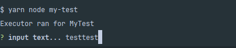

# Nx bug report

## Current behavior

When use `@inquirer/prompts` in `nx`, last line of the prompt is not visible.

EX )


## Expected behavior

Last line of the prompt should be visible like below image.




## Steps to reproduce

1. Clone repository for reproduce this issue.
   - `git clone https://github.com/ChoSeoHwan/nx-bug-report-1.git`
2. Initialize repository.
   - `yarn install`
3. Run reproduce command.
   - `yarn nx run my-test`


## Environment
```bash
 yarn nx report

 NX   Report complete - copy this into the issue template

Node   : 20.12.2
OS     : win32-x64
yarn   : 4.2.1

nx                 : 19.0.1
@nx/js             : 19.0.1
@nx/jest           : 19.0.1
@nx/eslint         : 19.0.1
@nx/devkit         : 19.0.1
@nx/eslint-plugin  : 19.0.1
@nx/plugin         : 19.0.1
typescript         : 5.4.5
---------------------------------------
Local workspace plugins:
         @nx-bug-report-1/plugin
```
